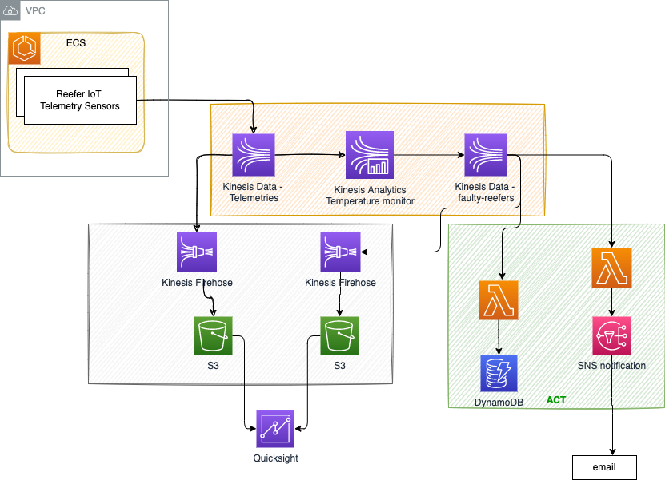

# Reefer simulator to Kinesis Streams

## What this is about

The code is the Reefer simulator to sent telemetries events to Kinesis Data Streams (the top left component on the left of the figure below)



## Unit testing

```sh
python reefer_simulator_tool.py local
```

## Run it in Cloud9


* Copy paste the `reefer_simulator_tool.py` and the `app` folder
* Install boto3 library to access AWS API: `pip install boto3`
* Set STREAM_NAME environment variable in Terminal

```sh
export STREAM_NAME=telemetries
```

* Create a Kinesis Data Streams service named `telemetries` with 1 shard
* Start

```sh
python reefer_simulator_tool.py aws
```

* Stop it with Control-C

## Build docker image

* Build

```sh
cd app
docker build -t jbcodeforce/reefer-simulator .
```

* Run locally

```sh
docker run -v $(pwd):/app -e STREAM_NAME=telemetries -ti -p 5000:5000 jbcodeforce/reefer-simulator
```

Access the OpenAPI doc at [http://localhost:5000/apidocs](http://localhost:5000/apidocs).

* Push to dockerhub

```sh
docker push jbcodeforce/reefer-simulator
```

* Push to you ECR

## Deploy with Fargate

* 